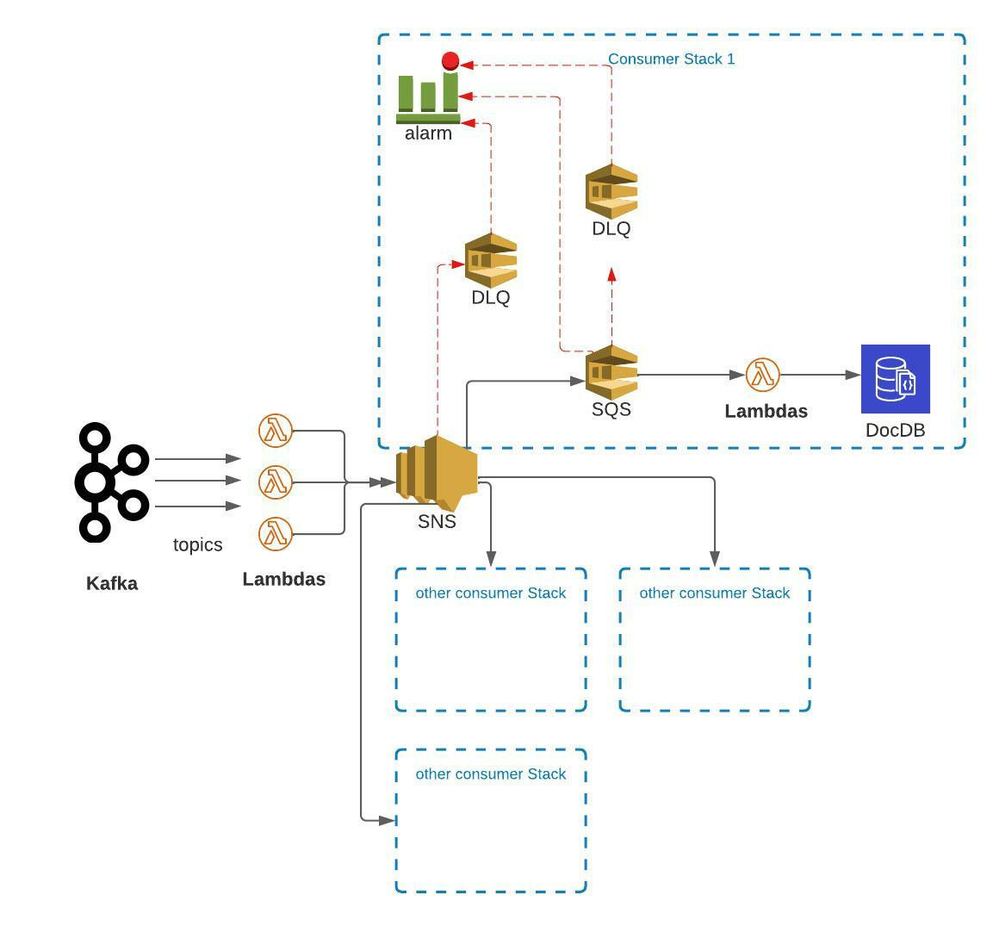

# About the project

This is a simple aws serverless project with the following resources using serverless v3:
Kafka -> lambda -> SNS -> SQS -> lambda -> docdb



## Installation/deployment instructions

- Run `npm i` to install the project dependencies
- Run `npx sls deploy` to deploy this stack to AWS

## Test your service

- `npx sls invoke local -f functionName --path src/functions/functionName/mock.json`

### sls deploy

```
sls deploy -s poc --region eu-west-1
```

### sls remove

```
sls remove -s poc --region eu-west-1
```
